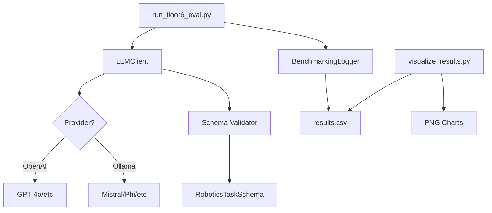

# Walkthrough - LaMMA-P Benchmarking Framework

This walkthrough demonstrates the features and usage of the modular benchmarking framework designed for the LaMMA-P robotics project.

## 🏗 System Design

The system is built to be modular and research-ready, with a clear separation between LLM interaction, data validation, and performance evaluation.



## 🛠 Key Features

### 1. Swappable LLM Adapter
The `LLMClient` provides a unified interface for both cloud (OpenAI) and local (Ollama) models. Switching is as simple as updating an environment variable.

### 2. Strict JSON Schema Enforcement
We use **Pydantic** to define a strict schema for robotics tasks. Any response that doesn't match the schema is automatically rejected and retried once.

### 3. "Floor 6" Benchmark Harness
A dedicated script `run_floor6_eval.py` handles multi-trial evaluations of the standard "Floor 6" test case, logging every aspect of the performance.

### 4. Symbolic Planning Bridge (PDDL)
The `PDDLGenerator` class automatically converts the LLM's JSON output into PDDL problem snippets. This ensures direct compatibility with Fast Downward and ROS2 planning pipelines.

### 5. Automated Ablation Runner
The `scripts/run_comparisons.py` utility allows you to iterate through multiple models (e.g., Mistral, Phi, GPT-4o) in a single command, automating the entire evaluation and visualization flow.

## 📈 Example Result Visualization

After running a benchmark, the `visualize_results.py` script aggregates all trials and generates comparative analysis:

- **Success Rate Comparison**: Visualizes the percentage of trials that resulted in valid JSON.
- **Latency Analysis**: Compares the average token generation speed across different models and quantizations.

## 📝 Usage Commands

### Run Evaluation
```bash
python evaluation/run_floor6_eval.py --model mistral:7b --provider ollama --trials 10
```

### Run Automated Ablation Study
```bash
python scripts/run_comparisons.py
```

### Generate Plots
```bash
python evaluation/visualize_results.py
```

## 🔬 Research & Defensive Strategies

As a production-grade research artefact, the system anticipates common failure points in LLM-driven robotics:

| Failure Point | Defensive Strategy |
| :--- | :--- |
| **Malformed JSON** | Pydantic validation + 1 automatic retry (Temperature=0). |
| **Local LLM Latency** | Asynchronous-ready calls and standardized latency logging. |
| **Model Hallucination** | System prompt enforcement + Schema validation. |
| **Connectivity Breaks** | `FALLBACK_TO_CLOUD` option allows seamless failover to OpenAI. |
| **Reproducibility** | Fixed random seeds (Temp=0) and explicit quantization logging. |

## 🚀 Ready for Research

This framework is built for academic reproducibility:
- **No hardcoded constants**.
- **Comprehensive logging** (CSV).
- **GPU-accelerated** support via Ollama.
- **Easy model comparison** (Ollama models vs GPT-4o).
