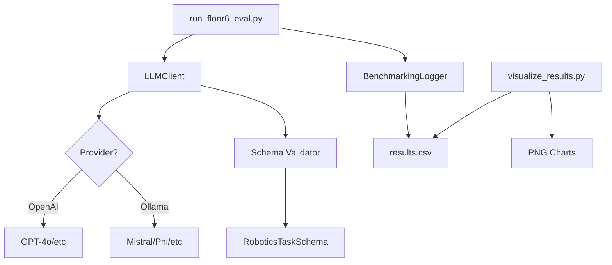

# Walkthrough - LaMMA-P Benchmarking Framework

This walkthrough demonstrates the features and usage of the modular benchmarking framework designed for the LaMMA-P robotics project.

## 🏗 System Design

The system is built to be modular and research-ready, with a clear separation between LLM interaction, data validation, and performance evaluation.



## 🛠 Key Features

### 1. Swappable LLM Adapter
The `LLMClient` provides a unified interface for both cloud (OpenAI) and local (Ollama) models. Switching is as simple as updating an environment variable.

### 2. Strict JSON Schema Enforcement
We use **Pydantic** to define a strict schema for robotics tasks. Any response that doesn't match the schema is automatically rejected and retried once.

### 3. State-Aware Logical Validation
The `PlanValidator` now tracks object states (opened/closed, toggleable on/off). It enforces physical constraints from AI2-THOR, such as:
- **Container Constraint**: Cannot pick up an object from a closed fridge or drawer.
- **State Constraint**: Cannot place an object inside a closed microwave.
- **Toggleable Support**: Tracks the state of machines like coffee makers or stoves.

### 4. Advanced PDDL Generation
The `PDDLGenerator` supports **initial state predicates** and is aligned with AI2-THOR's logical representation (`opened`, `closed`, `switchedOn`). This ensures plans are compatible with standard symbolic planners.

### 5. AI2-THOR Benchmarking Scenarios
We've generalized the evaluation harness to support AI2-THOR floor plans (e.g., `FloorPlan1`) and object categories.
- **Kitchen Breakfast**: A dedicated test case where the agent must interact with a fridge, microwave, and coffee machine.
- **Lab Maintenance**: A multi-step cleaning task.

## 📈 Example Result Visualization

After running a benchmark, the `visualize_results.py` script aggregates all trials and generates comparative analysis:

- **Execution Readiness**: Compares JSON validity and logical consistency across different models.
- **Latency Analysis**: Compares the average token generation speed across different models and quantizations.

## 📝 Usage Commands

### Run AI2-THOR Evaluation
```bash
python evaluation/run_eval.py --model mistral:7b --provider ollama --trials 10 --testcase kitchen_breakfast
```

### Run Automated Ablation Study
```bash
python scripts/run_comparisons.py
```

### Generate Plots
```bash
python evaluation/visualize_results.py
```

## 🔬 Research & Defensive Strategies

As a production-grade research artefact, the system anticipates common failure points in LLM-driven robotics:

| Failure Point | Defensive Strategy |
| :--- | :--- |
| **Malformed JSON** | Pydantic validation + 1 automatic retry (Temperature=0). |
| **Local LLM Latency** | Asynchronous-ready calls and standardized latency logging. |
| **Model Hallucination** | System prompt enforcement + Schema validation. |
| **Connectivity Breaks** | `FALLBACK_TO_CLOUD` option allows seamless failover to OpenAI. |
| **Reproducibility** | Fixed random seeds (Temp=0) and explicit quantization logging. |

## 🚀 Ready for Research

This framework is built for academic reproducibility:
- **No hardcoded constants**.
- **Comprehensive logging** (CSV).
- **GPU-accelerated** support via Ollama.
- **Easy model comparison** (Ollama models vs GPT-4o).
